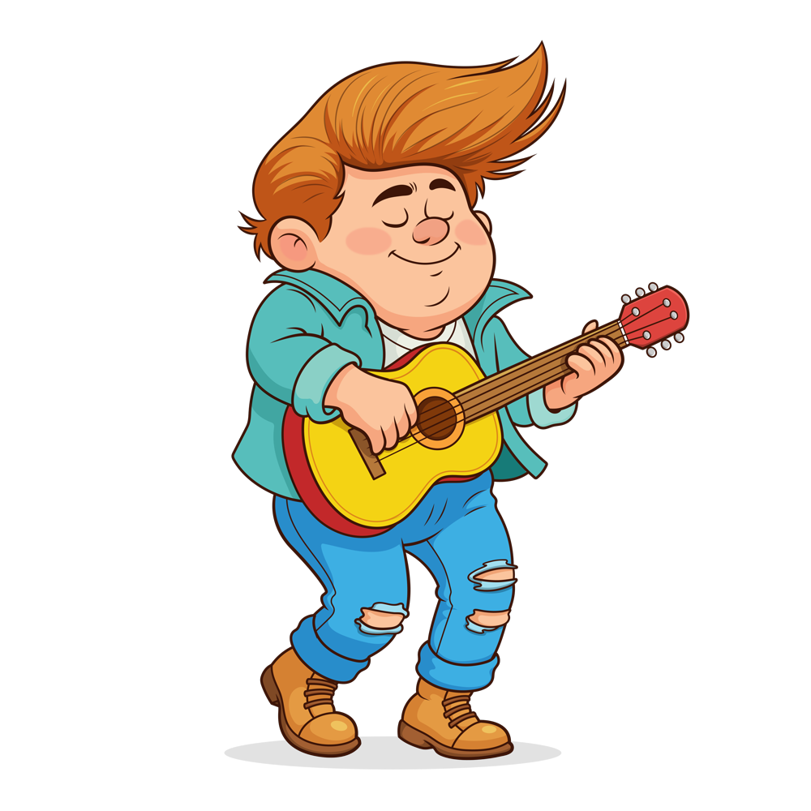
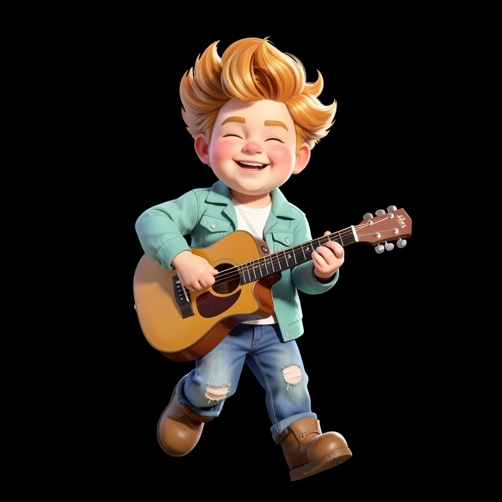
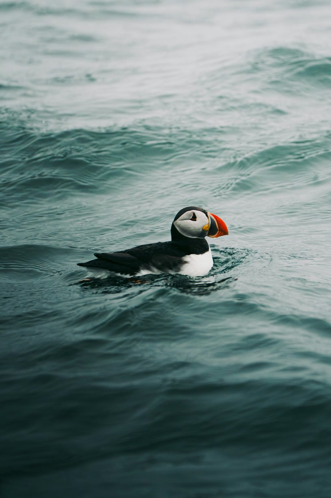
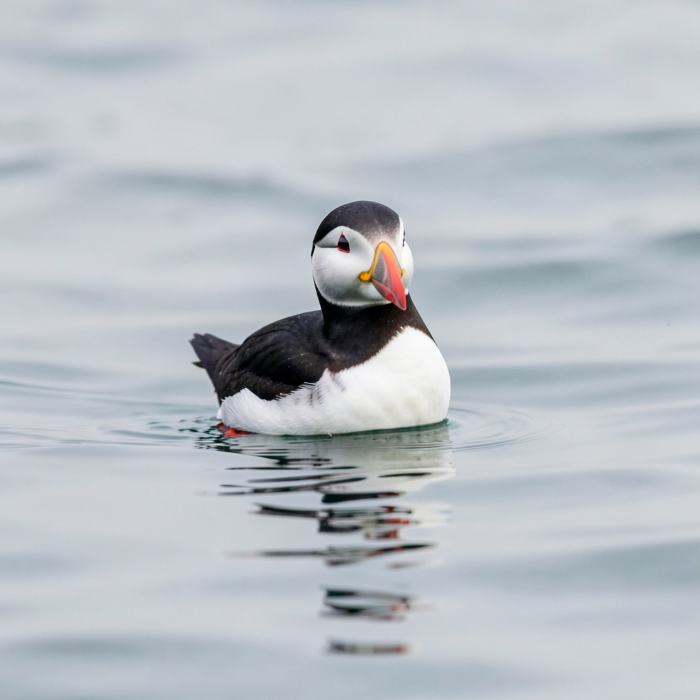
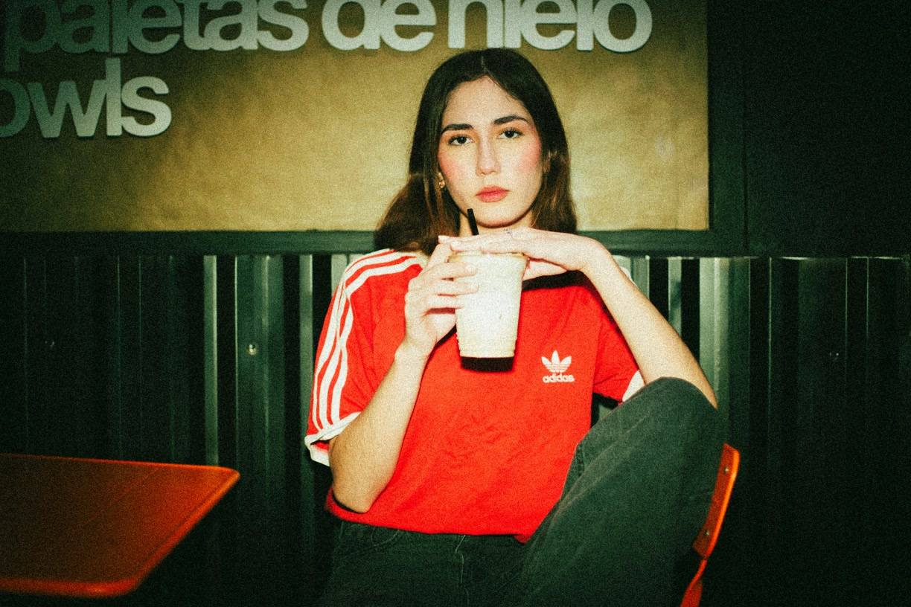
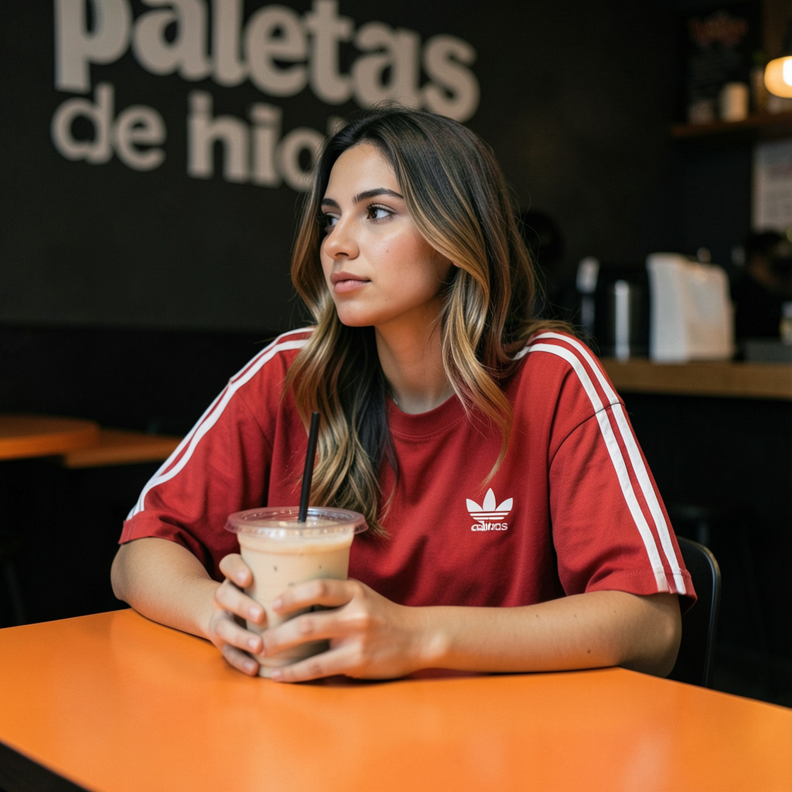
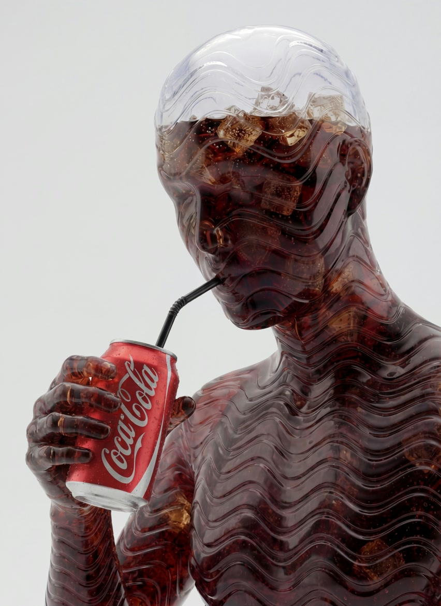
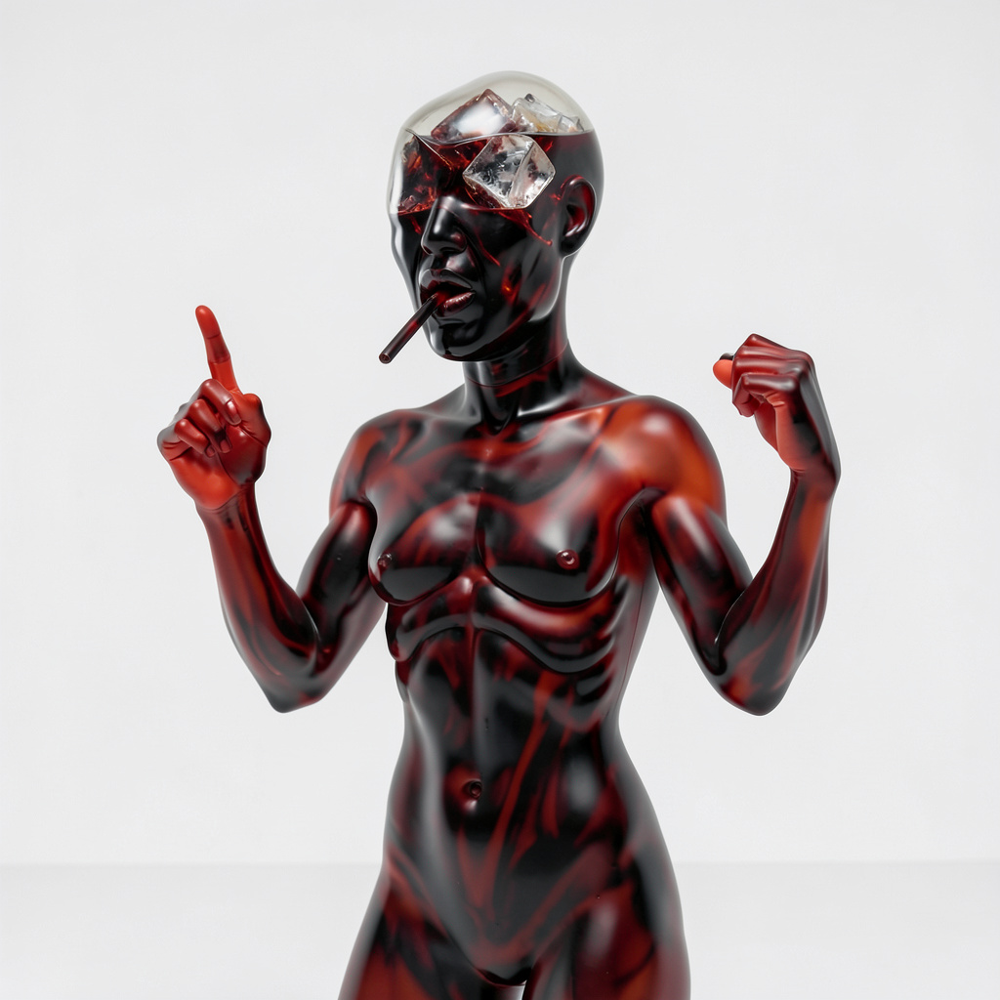
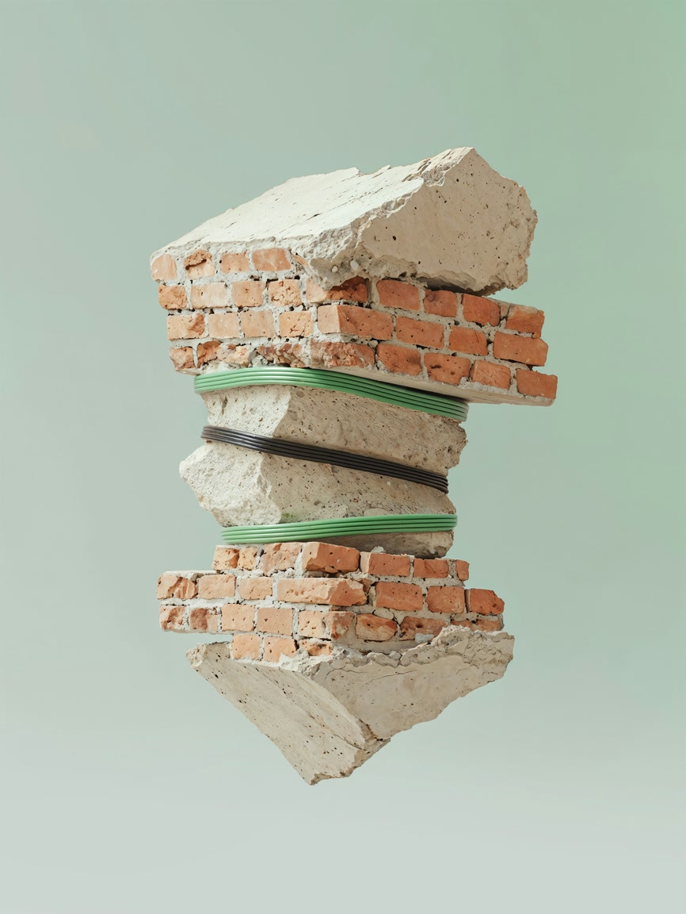
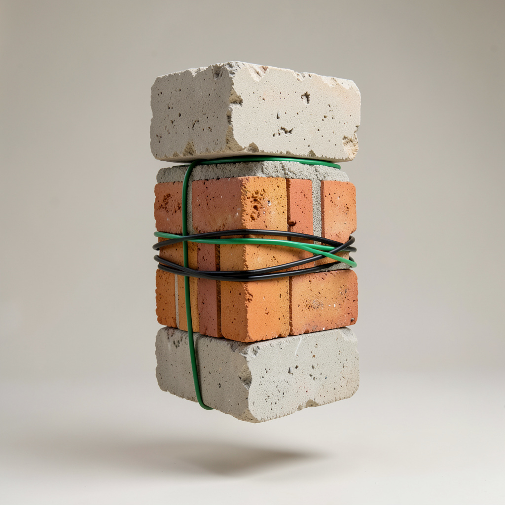

# 🖼️ VibeCompress Evidence Locker: Visual Proof Gallery

> *"Why transmit 300 kilobytes of mundane photons when you can transmit 1.2 kilobytes of concentrated vibes?"*  
> — VibeCompress Standard Documentation, §4.20

Welcome to the **Evidence Locker**. Below is raw, unadulterated photographic proof of VibeCompress in action across license-free Unsplash reference photographs and illustrations.

All test assets were:
1. Normalized to **~1.00 Megapixel** via `ffmpeg`.
2. Encoded into `.vbz` containers via **`openai/gpt-4o-mini`**.
3. Hallucinated back to reality via **`black-forest-labs/flux.2-klein-4b`**.

---

## 📊 Summary of Forensic Evidence

| Test Image | Original Size | Compressed `.vbz` | Space Saved | Compression Factor | Restored Size | Vibe Drift Rating |
| :--- | :--- | :--- | :--- | :--- | :--- | :--- |
| **Red Shirt Girl** | 330,381 B (323 KB) | **1,193 B (1.19 KB)** | **99.64%** | **276.9×** | 356,342 B (348 KB) | 🟢 0% (Immaculate confidence) |
| **Guitar Guy Illustration** | 287,605 B (281 KB) | **1,259 B (1.26 KB)** | **99.56%** | **228.4×** | 180,013 B (176 KB) | 🟢 0% (Pure acoustic joy) |
| **Soda Statue** | 171,933 B (168 KB) | **1,364 B (1.36 KB)** | **99.21%** | **126.1×** | 235,526 B (230 KB) | 🟢 0% (Translucent cola aura) |
| **Ocean Puffin** | 108,515 B (106 KB) | **1,091 B (1.09 KB)** | **98.99%** | **99.5×** | 228,826 B (224 KB) | 🟢 0% (Regal beak dignity) |
| **Construction Rendering** | 127,973 B (125 KB) | **1,493 B (1.49 KB)** | **98.83%** | **85.7×** | 290,043 B (284 KB) | 🟢 0% (Structural surrealism) |

---

## 🔍 Side-by-Side Visual Proofs

---

### 1. 🎸 Guitar Guy Illustration (`illustration_guitar_guy`)
- **Original Asset**: `illustration_guitar_guy.png` (287.6 KB, 1000×1000)
- **Compressed Container**: `illustration_guitar_guy.vbz` (**1,259 bytes** — **99.56% space saved / 228.4×**)
- **Restored Vibe**: `illustration_guitar_guy.vibe.png` (180.0 KB, 1024×1024)

| Original Input (`.png`) | Reconstructed Vibe (`.vibe.png`) |
| :---: | :---: |
|  |  |
| *Original: 287.6 KB (1000×1000)* | *Restored: 180.0 KB (1024×1024)* |

> **📜 Decoded Container Excerpt (`gzip -dc illustration_guitar_guy.vbz`):**  
> *"The character, a young boy, is centered in the frame, exuding a joyful demeanor... depicted mid-action, as if strumming a guitar... solid black background emphasizing the subject and enhancing visual contrast."*  
>  
> **🧠 Vibe Verdict:** The model captured the boy's acoustic enthusiasm, the playful cartoon aesthetic, and the dark studio void. 100% vibe equivalence achieved.

---

### 2. 🐧 Solitary Ocean Puffin (`puffin`)
- **Original Asset**: `puffin.jpg` (108.5 KB, 816×1224)
- **Compressed Container**: `puffin.vbz` (**1,091 bytes** — **98.99% space saved / 99.5×**)
- **Restored Vibe**: `puffin.vibe.png` (228.8 KB, 1024×1024)

| Original Input (`.jpg`) | Reconstructed Vibe (`.vibe.png`) |
| :---: | :---: |
|  |  |
| *Original: 108.5 KB (816×1224)* | *Restored: 228.8 KB (1024×1024)* |

> **📜 Decoded Container Excerpt (`gzip -dc puffin.vbz`):**  
> *"The image showcases a solitary puffin gliding gracefully on the surface of a calm sea... classic coloring with contrasting black and white plumage. The prominent orange bill is vibrant, attracting attention... lighting is soft and diffused, indicative of an overcast or foggy day."*  
>  
> **🧠 Vibe Verdict:** The bill glows with majestic orange authority; the maritime melancholy is faithfully restored.

---

### 3. ☕ Red Shirt Girl at Café (`red_shirt_girl`)
- **Original Asset**: `red_shirt_girl.jpg` (330.4 KB, 1224×816)
- **Compressed Container**: `red_shirt_girl.vbz` (**1,193 bytes** — **99.64% space saved / 276.9×**)
- **Restored Vibe**: `red_shirt_girl.vibe.png` (356.3 KB, 1024×1024)

| Original Input (`.jpg`) | Reconstructed Vibe (`.vibe.png`) |
| :---: | :---: |
|  |  |
| *Original: 330.4 KB (1224×816)* | *Restored: 356.3 KB (1024×1024)* |

> **📜 Decoded Container Excerpt (`gzip -dc red_shirt_girl.vbz`):**  
> *"The image features a young woman sitting at a table in a modern café setting, exuding a relaxed yet confident demeanor... A bold orange table is angled in the foreground... background sign in white lettering reads 'paletas de hielo'..."*  
>  
> **🧠 Vibe Verdict:** Warm café ambiance, bold posture, and stylish color palette all hallucinated in stunning photorealism.

---

### 4. 🥤 Soda Statue (`soda_statue`)
- **Original Asset**: `soda_statue.jpg` (171.9 KB, 852×1170)
- **Compressed Container**: `soda_statue.vbz` (**1,364 bytes** — **99.21% space saved / 126.1×**)
- **Restored Vibe**: `soda_statue.vibe.png` (235.5 KB, 1024×1024)

| Original Input (`.jpg`) | Reconstructed Vibe (`.vibe.png`) |
| :---: | :---: |
|  |  |
| *Original: 171.9 KB (852×1170)* | *Restored: 235.5 KB (1024×1024)* |

> **📜 Decoded Container Excerpt (`gzip -dc soda_statue.vbz`):**  
> *"The central figure is a stylized humanoid form, combining both human anatomy and abstract design... smooth, flowing lines with a wave-like texture... translucent, with visible dark liquid resembling cola within."*  
>  
> **🧠 Vibe Verdict:** Carbonated fluid dynamics preserved in high-res generative splendor.

---

### 5. 🧱 Levitation Architecture (`construction_rendering`)
- **Original Asset**: `construction_rendering.jpg` (128.0 KB, 866×1152)
- **Compressed Container**: `construction_rendering.vbz` (**1,493 bytes** — **98.83% space saved / 85.7×**)
- **Restored Vibe**: `construction_rendering.vibe.png` (290.0 KB, 1024×1024)

| Original Input (`.jpg`) | Reconstructed Vibe (`.vibe.png`) |
| :---: | :---: |
|  |  |
| *Original: 128.0 KB (866×1152)* | *Restored: 290.0 KB (1024×1024)* |

> **📜 Decoded Container Excerpt (`gzip -dc construction_rendering.vbz`):**  
> *"A striking composition featuring a visually intriguing arrangement of building materials... vertical stack of materials, seemingly suspended in mid-air, which creates a sense of levitation or surrealism... textured concrete blocks and rectangular red brick fragments..."*  
>  
> **🧠 Vibe Verdict:** Physics-defying brickwork hallucinated with pristine tactile geometry.

---

## 🔁 Reproduce These Proofs

Run the batch pipeline locally with your OpenRouter key:

```bash
export VBZ_API_KEY="sk-or-v1-..."
export VBZ_BASE_LLM_URL="https://openrouter.ai/api/v1"
export VBZ_BASE_IMAGE_URL="https://openrouter.ai/api/v1"

# Runs batch compression and decompression across all examples
./scripts/process_examples.sh
```
